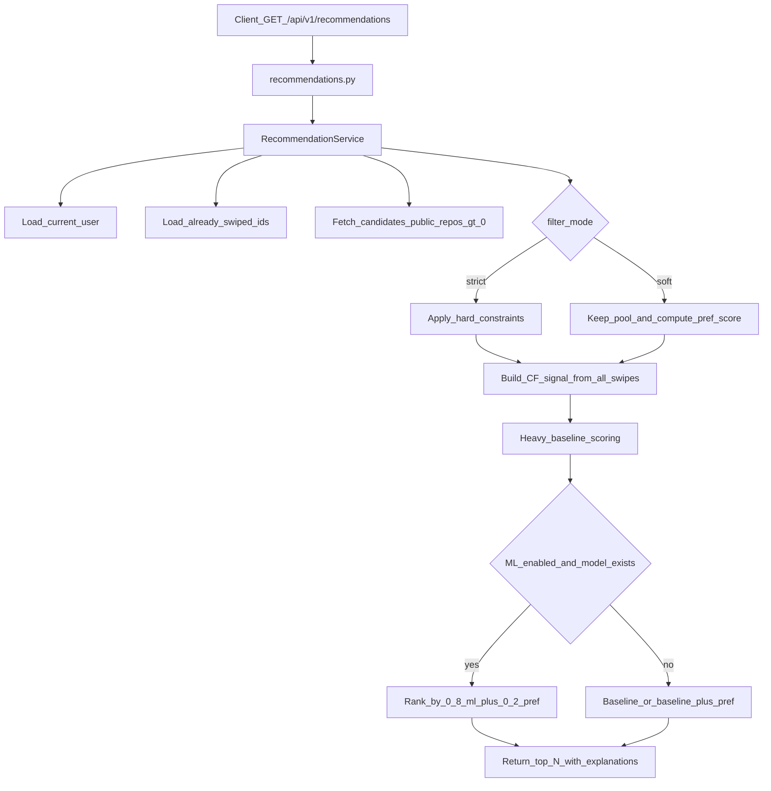

# Matching, Ranking, and ML: How It Works

This document explains the **current implementation** of recommendation logic in the GitAlong backend.

## Scope

This covers:
- candidate generation
- hard constraints and soft preference filters
- baseline ranking
- ML reranking
- model training and persistence
- output fields exposed to clients

Core files:
- `backend/app/api/v1/recommendations.py`
- `backend/app/services/recommendation_service.py`
- `backend/app/services/heavy_recommendation_engine.py`
- `backend/app/services/ml_features.py`
- `backend/app/services/ml_ranker.py`
- `backend/app/services/ml_trainer.py`
- `backend/app/repositories/user_repository.py`
- `supabase_ml.sql`

---

## 1) Request flow (online inference)

Endpoint:
- `GET /api/v1/recommendations`

Supported query params:
- `limit`
- `languages` (repeatable)
- `interests` (repeatable)
- `location`
- `min_followers`
- `min_public_repos`
- `active_within_days`
- `filter_mode` = `soft | strict` (default `soft`)

Auth:
- Supabase JWT via `Authorization: Bearer <token>`

### High-level pipeline

---

## 2) Candidate generation and hard quality gate

Candidates are fetched from `public.users` with:
- `public_repos > 0` (**hard gate**)
- not in `exclude_ids` (`already swiped` + `self`)
- DB limit based on `limit * candidate_pool_multiplier` (expanded 3x when filters are active)

Implementation:
- `UserRepository.get_candidates()` in `backend/app/repositories/user_repository.py`

So, accounts with zero public repos are excluded before ranking.

---

## 3) Filters: strict vs soft

## Strict mode
- `filter_mode=strict`
- candidates not matching constraints are removed before ranking
- constraints applied on:
  - languages overlap
  - interests overlap
  - location substring
  - min followers
  - min repos
  - active within days

Method:
- `_apply_filters(...)` in `RecommendationService`

## Soft mode (default)
- `filter_mode=soft`
- no hard exclusion from constraints
- compute `filter_preference_score` in `[0,1]` from the same dimensions
- use that score only as a ranking boost

Method:
- `_preference_score(...)` in `RecommendationService`

---

## 4) Baseline ranking (non-ML engine)

Baseline scorer:
- `HeavyRecommendationEngine.score_candidates(...)`

Signals include:
- language similarity
- interest/topic similarity
- activity similarity
- collaborative popularity (`cf_norm`)
- location bonus
- recency bonus

Returns:
- per-candidate `score` (0-100 scale)
- `score_breakdown` dictionary

---

## 5) ML reranking (logistic regression)

ML is enabled with config:
- `ML_RANKING_ENABLED=true`
- model name from `ML_MODEL_NAME` (default `logreg_v1`)

Inference class:
- `MlRanker` (`backend/app/services/ml_ranker.py`)

### Feature vector per viewer-candidate pair

Defined in `extract_pair_features(...)`:
- `lang_jaccard`
- `topic_jaccard`
- `lang_intersection`
- `topic_intersection`
- `followers_sim`
- `repos_sim`
- `cand_has_avatar`
- `cand_has_bio`
- `cand_rec_le_7d`
- `cand_rec_le_30d`
- `cand_rec_le_90d`
- `cf_norm`
- `bias`

### Scoring formula

- linear logit: `z = b + Σ(w_i * x_i)`
- probability: `p_like = sigmoid(z)`

Top reason extraction:
- rank positive feature contributions `w_i * x_i`
- return top 3 keys as `ml_top_reasons`

### Final rank key (when ML is active)

In current implementation:
- if soft filters active: `0.8 * ml_score + 0.2 * filter_preference_score`
- baseline score is tie-breaker

If ML params are missing:
- fallback to baseline sorting (with optional soft preference blend in non-ML path)

---

## 6) Training pipeline

Admin endpoint:
- `POST /api/v1/admin/retrain-ml`
- requires header `X-Admin-Secret` matching `ADMIN_RETRAIN_SECRET`

Trainer class:
- `MlTrainer` (`backend/app/services/ml_trainer.py`)

Training data:
- from `swipes` table (`swiper_id`, `swiped_user_id`, `action`)
- labels:
  - `1` for `like` or `superLike`
  - `0` for `dislike`
- sample weight:
  - `superLike` weighted higher (`superlike_weight`, default `3.0`)

Model:
- `sklearn.linear_model.LogisticRegression`
- L2 regularization, lbfgs solver

Validation:
- time-aware split (oldest train, newest validation)
- fallback to all-data train when tiny datasets collapse class diversity in split
- AUC computed only when validation has both classes

Persistence:
- writes to `public.ml_model_params`:
  - `model_name`
  - `version`
  - `trained_at`
  - `weights` (`b`, `w`)
  - `feature_schema`

---

## 7) Model storage schema

Defined in `supabase_ml.sql`:
- `public.ml_model_params`
- `public.ml_feature_stats` (optional normalization stats table)

RLS:
- read allowed
- writes blocked from normal clients
- backend writes with service-role key

---

## 8) Response fields clients can use

Each recommendation item currently may include:
- `match_score` (baseline score)
- `score_breakdown` (baseline components)
- `ml_like_prob` (when ML active and model exists)
- `ml_top_reasons` (when ML active)
- `filter_preference_score` (when soft filters are active)

Top-level response:
- `user_id`
- `recommendations`
- `total`
- `algorithm` (`ml_logreg_rerank_v1` or `heavy_ml_hybrid_v2`)

---

## 9) Practical implications

- ML currently **reranks users**, it does not enforce hard constraints by itself.
- Constraints are explicit product rules via filters (`strict` vs `soft`).
- Quality gate (`public_repos > 0`) is enforced at candidate retrieval.
- With very small swipe data, ML weights are noisy; quality improves with more interaction volume.

---

## 10) Quick debug checklist

If recommendations look wrong:
1. Check `/api/v1/health` is connected.
2. Check `ML_RANKING_ENABLED`.
3. Check `ml_model_params` has a row for current `ML_MODEL_NAME`.
4. Inspect `algorithm` in response.
5. Verify `filter_mode` and filter params sent by client.
6. Confirm users in DB have `public_repos > 0` and useful metadata (`languages`, `interests`).

